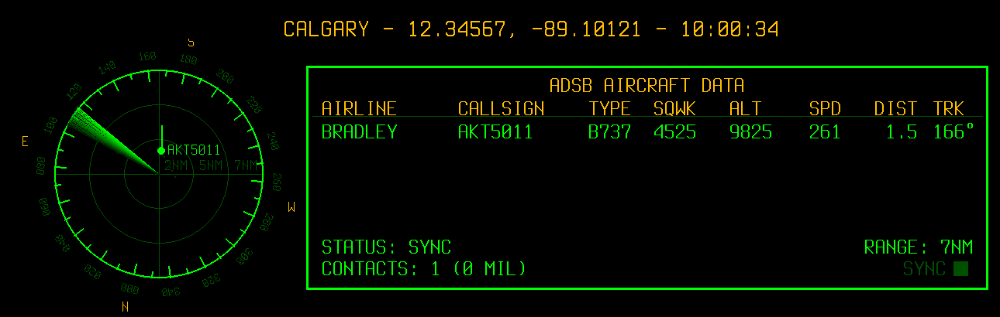

# Retro ADS-B Radar
> 🤖 **AI Vibe Coded:** This project was done with Gemini, prioritizing my own customizations. I think the terrain feature is busted.

> **Original Credits:**
> This project is a fork of [nicespoon's retro-adsb-radar](https://github.com/nicespoon/retro-adsb-radar.git).  
> **License:** MIT License (Code) | SIL Open Font License 1.1 (Fonts)

## ✈ Project Overview
This fork modifies the original radar to run on an **adsb.im** Raspberry Pi image using a **Waveshare 400x1280 HDMI display** (Portrait Mode).


## 🛠 Key Changes & Features
### 1. Data Table
The data display has been expanded to 8 columns:
- **AIRLINE:** Extracted from `ownOp` (First word only).
- **CALLSIGN:** Standard flight ID.
- **TYPE:** Aircraft model (extracted from `t` in JSON).
- **SQWK:** Squawk code with visual alerting.
- **ALT / SPD / DIST / TRK:** Standard telemetry.

### 2. Visual Alerting System
The UI now uses color-coded logic to highlight states:
- **RED (Flashing):** Emergency Squawks (`7700`, `7500`).
- **AMBER:** Radio Failure (`7600`).
- **RED (Solid):** Military Aircraft.
- **WHITE:** VFR Traffic (`1200`).
- **BRIGHT GREEN:** Standard Commercial Traffic.

### 3. Display Geometry
- **Resolution:** Hardcoded for **400x1280** (Portrait).
- **Burn-in Protection:** Includes a 5px pixel-shift jitter every 5 minutes.

### 4. Radar Scope
- **Compass:** Added NESW markers.
- **Degrees:** Degrees and tick marks are now around the radar.
- **Sweep:** Added a trail glow visual to the radar sweep line at 12 RPM.

## ⚙ Installation
### 1. Hardware & OS
- Raspberry Pi running `adsb.im` image.
- Waveshare 7.9inch HDMI LCD (or similar 400x1280 display).

### 2. Prerequisites
Install these to ensure Pygame has the necessary SDL libraries for graphics, audio, and fonts.
```bash
sudo apt update
sudo apt install -y python3-pygame libsdl2-2.0-0 libsdl2-image-2.0-0 libsdl2-mixer-2.0-0 libsdl2-ttf-2.0-0 libsdl2-gfx-1.0-0
```
Edit the boot config for waveshare display
```bash
sudo nano /boot/firmware/config.txt
```
With:
```
# Waveshare 7.9inch HDMI LCD
hdmi_group=2
hdmi_mode=87
hdmi_timings=400 0 100 10 140 1280 10 20 20 2 0 0 0 60 0 43000000 3
dtoverlay=vc4-kms-v3d
max_framebuffer_width=1280
max_framebuffer_height=1280
display_rotate=1
```
Reboot

### 3. Service Installation
This fork includes a portable installer to set up the systemd service automatically.

```bash
# Make the installer executable
chmod +x /root/retro-adsb-radar/install_service.sh

# Run the installer
sudo ./install_service.sh
```

## 📝 Configuration (config.ini)
The configuration file has been updated to support the new display geometry and local data fetching.

### Key Additions
- **TAR1090_URL:** Points to your local JSON feed (critical for independent operation).
- **TERRAIN:** Enables the custom map overlay logic.
- **MIL_PREFIX_LIST:** Comma-separated list of hex prefixes to flag as military (Solid Red).

```ini
[DISPLAY]
# Waveshare Portrait Geometry
FULLSCREEN = True
# Rotate the radar according to your viewpoint of the radar in the physical world
RADAR_ROTATION = 0
# Show terrain in the radar scope
TERRAIN = True
```

## 🗺️ Terrain Setup (Optional)
To enable the map overlay (rivers, major roads) on the radar scope:

1. Go to **geojson.io**
2. Navigate to your radar location
3. Use **Draw LineString** or **Draw Polygon** to trace features you want on the radar  
   (Bow River, Deerfoot, etc).
4. Click **Save → GeoJSON**.
5. Rename downloaded file to: /root/retro-adsb-radar/terrain.json
6. Ensure this is enabled in config: TERRAIN = True